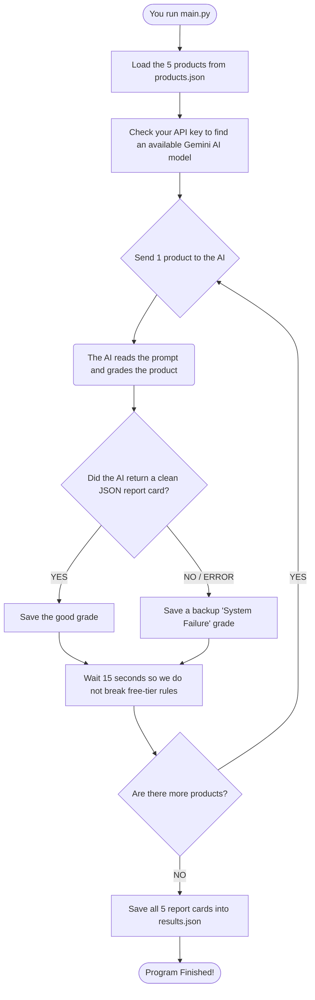

# 🏗️ System Architecture & Logic Flow

This document explains exactly how our code works in very simple terms. It shows step-by-step how a product goes in, and how a graded report card comes out.

---

## 🤷‍♂️ 1. Why We Did It This Way

It is easy to make a chat bot that says, "Hello, how can I help?" but that is not useful for a business with 1,000 products. A chat bot gives back messy text.

Instead, we built a strict assembly line. We force the AI to return simple, clean data (called JSON). Because the data is clean and organized, our website can easily look at it and say, "This product grade is RED, let's paint the screen red!" 

---

## 🗺️ 2. The Flowchart

This flowchart shows the exact path the data takes when you run the program. 



---

## 📂 3. The Files

We broke our code into 4 small files so it does not get messy:

* **`products.json`:** This holds our 5 test products. We added a special field called `merchant_intent` which tells the AI what the seller was *trying* to sell.
* **`data_loader.py`:** A tiny helper tool that opens the `products.json` file safely.
* **`evaluator.py`:** The most important folder. This holds the strict rules we send to the AI. It forces the AI to only output the JSON report card and nothing else.
* **`main.py`:** The boss. It controls everything. It loads the data, sends it to the `evaluator`, waits 15 seconds to be safe, and then saves the final answers.

---

## 📥 4. Input and Output (The Data)

### What goes IN (Input)
We feed the AI a simple product with a title, price, description, and the seller's true goal (`merchant_intent`).

```json
{
  "id": "prod_3",
  "title": "Men's Black Leather Wallet",
  "description": "Stay stylish with this beautiful brown fake leather wallet.",
  "merchant_intent": "Sell a cheap fake leather wallet."
}
```

### What comes OUT (Output)
The AI thinks about it and spits out a clean report card. Notice how it catches the problem: the title says "Black Leather" but the description says "Brown Fake Leather".

```json
{
  "product_id": "prod_3",
  "readiness_score": 35,
  "status": "red",
  "evaluation": {
    "consistency": { 
      "passed": false, 
      "feedback": "The title says black leather, but the description says brown fake leather." 
    }
  },
  "misalignment": {
    "merchant_intent": "Sell a cheap fake leather wallet.",
    "gap": "The seller wants to sell a fake wallet, but called it real leather in the title.",
  },
  "suggested_fix": {
    "field": "title",
    "updated_text": "Men's Brown Fake Leather Wallet"
  }
}
```

### Why this is awesome
Because the output is perfectly organized, our website can easily take the `"suggested_fix"` and put a big button on the screen that says **"Apply Fix!"** When the user clicks it, it fixes their database instantly.
