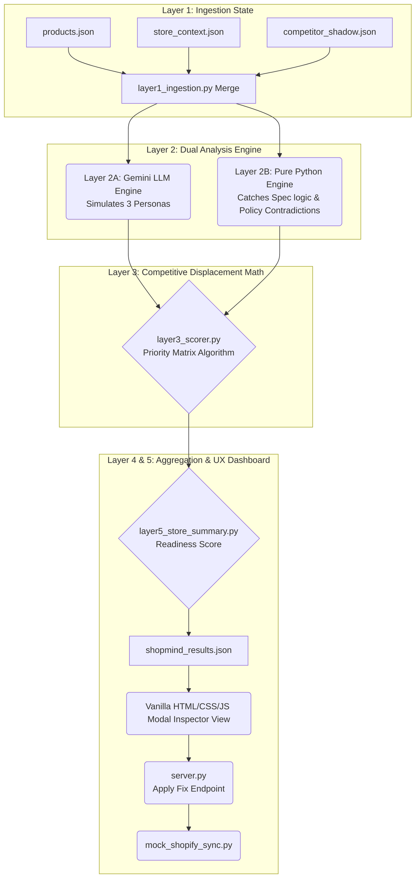

# The ShopMind Architecture Deep Dive

ShopMind relies on a sophisticated **5-Layer Pipeline** to process data efficiently. We deliberately separated the abstract LLM logic from the strict software engineering checks.

## High-Level Logic Diagram

---

## The Codebase Explained

### Layer 1: Context is King
`layer1_ingestion.py` marries 3 critical data points:
1.  **Product Data:** The actual items being audited.
2.  **Store Context:** To see if site-wide policies (shipping, returns) conflict with individual listing text.
3.  **Competitor Shadows:** We evaluate products against a known generic rival (like "Amazon Basics") to raise the stakes.

### Layer 2A: The Smart LLM (`layer2_llm.py`)
Instead of hitting the Google Gemini API 50 times per product, we optimized the prompt to force the LLM to output a complex JSON structure evaluating **Three AI Personas** in a single call. 
*Innovation:* The personas are dynamically injected based on the category (e.g. `Electronics` uses a `procurement_agent`, while `Footwear` uses a `podiatrist_ai`). The LLM is also specifically prompted to analyze the gap between the `merchant_intent` and the actual listing text.
If the API hits a Rate Limit (429), it gracefully returns a "System Failure" payload but allows the rest of the pipeline to continue.

### Layer 2B: The Fast Deterministic Rule Engine (`layer2_deterministic.py`)
This is pure, high-speed Python. It uses regex and string analysis strictly to detect logical fallacies (Title says "Red", description says "Blue"). AI struggles with counting and absolute logic; this layer guarantees those issues are caught instantly without API costs.

### Layer 3: The Scorer (`layer3_scorer.py`)
This runs the bespoke algorithm to assign a quantifiable urgency to the detected gaps:
`impact_score = (ai_rejection_probability * 0.5) + (conversion_loss_weight * 0.3) + (fix_difficulty_inverse * 0.2)`
It also checks the competitor metrics to generate a direct **Displacement Risk** warning.

### Layer 4 & 5: The UX Dashboard & Store Summary
`layer5_store_summary.py` calculates an overarching `Store AI Readiness Score` based on aggregate vulnerabilities and missing trust signals (like bad FAQ coverage). 
`index.html` + `app.js` + `style.css` form a premium CSS grid with glassmorphism backgrounds. It natively fetches the JSON payload, organizes it into priority cards, and uses a local `server.py` to allow users to "Accept & Apply Fix" to a mocked Shopify integration loop.
