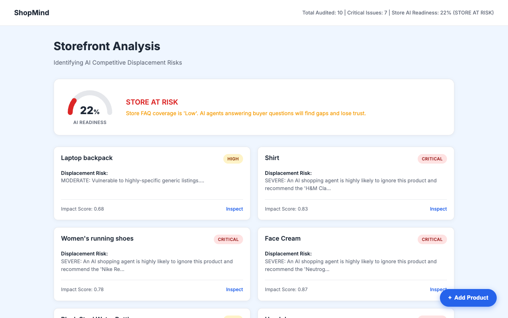
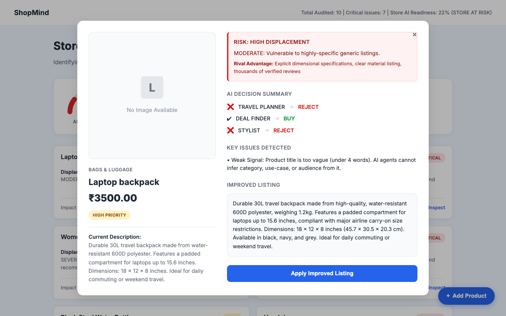

# ShopMind: The AI Representation Optimizer

**Ensuring your products are seen, understood, and recommended by AI shopping agents.**

---

## The Problem: The Hidden Revenue Leak

We are entering the era of AI Commerce. Consumers are increasingly relying on AI shopping agents, ChatGPT, and smart assistants to find products. 

However, AI agents rely entirely on product data to make recommendations. If your product listings have poor data, missing details, or ambiguous descriptions, **AI agents will ignore your products**. 

This is the new SEO—if you aren't optimized for AI, you suffer from a hidden revenue loss. Traditional tools optimize for search engines; nothing optimizes for AI perception.

---

## The Solution: ShopMind

ShopMind is a **competitive displacement engine** and representation optimizer. It simulates how an AI shopping agent perceives your product listings, identifies where the AI gets confused or rejects your product, and automatically generates actionable fixes to ensure your products win the AI recommendation.

---

## The "Wow" Factor

*   **Dual-Layer Intelligence:** ShopMind doesn't just use an LLM. It combines an AI Simulation Layer (LLM) for nuanced reasoning with a Deterministic Engine for strict, rule-based validation.
*   **AI Perception Simulation:** We literally simulate the "persona" of an AI shopping assistant to see if it would recommend your product over a competitor's.
*   **Closed Action Loop:** We don't just detect issues. The system detects problems, scores the impact, generates the fix, and provides a 1-click sync back to your store (mocked Shopify sync).

---

## System Workflow

Here is how ShopMind processes a store's catalog step-by-step:

1.  **Input Data:** The system ingests store context, product catalogs, and competitor data.
2.  **AI Simulation (LLM):** The product is passed to an LLM simulating an AI shopping assistant to gauge qualitative appeal and reasoning.
3.  **Deterministic Engine:** A strict rule-based engine evaluates structural data (e.g., missing policies, low contrast, text length).
4.  **Scoring Engine:** The outputs are merged to calculate an AI Rejection Probability, Conversion Loss, and a Priority Level (CRITICAL / HIGH / MEDIUM).
5.  **Store Summary:** Individual product scores are aggregated into a top-level Store AI Readiness Score.
6.  **Dashboard UI:** Merchants view their store health and problematic products on a premium, glassmorphism dashboard.
7.  **Apply Fix:** Merchants can review AI-generated recommendations and click "Apply Fix" to update the product data.
8.  **Mock Sync:** The fixed data is simulated to sync back to the e-commerce platform (e.g., Shopify).

---

## Architecture & Data Flow

### System Architecture Workflow

```text
[Store Catalog + Competitor Data]
               ↓
      [1. Ingestion Layer]
               ↓
    [2. AI Reasoning (LLM)]  <--->  [3. Deterministic Rules]
               ↓
      [4. Scoring Engine]
   (Impact, Priority, Fixes)
               ↓
      [5. Store Summary]
               ↓
     [6. Merchant Dashboard UI]
               ↓
    [7. Apply Fix Automation]
               ↓
    [8. E-commerce Sync (Mock)]
```

### Data Flow Explanation

1.  **JSON Data:** `products.json`, `store_context.json`, and `competitor_shadow.json` act as the initial state.
2.  **Backend Processing:** `shopmind_main.py` orchestrates the pipeline, passing data through `layer2_llm.py` and `layer2_deterministic.py`.
3.  **Aggregation:** `layer3_scorer.py` and `layer5_store_summary.py` compile the results into `shopmind_results.json`.
4.  **Frontend Delivery:** `server.py` serves the results to the dashboard (`app.js` + `index.html`).
5.  **Action:** Clicking "Apply Fix" updates `applied_fixes.json` and triggers `mock_shopify_sync.py`.

---

## Key Features

*   **Dual-Layer Analysis:** Merges LLM flexibility with deterministic reliability.
*   **Persona-Based AI Simulation:** Tests products against an AI agent's logic.
*   **Priority Scoring:** Ranks issues by Impact Score and Fix Difficulty so merchants know what to fix first.
*   **Actionable Fixes:** Generates exact replacement text and metadata to resolve the AI's confusion.
*   **Store Intelligence:** Provides a holistic view of the entire catalog's AI readiness.

---

## Why This Matters

As commerce shifts from traditional search (Google) to conversational AI, **AI Representation Optimization (AIRO)** is becoming mandatory. Merchants need to know how LLMs perceive their products. ShopMind proves that we can audit, score, and fix product data specifically for AI consumption, ensuring businesses survive the transition to agentic commerce. This isn't just a hackathon project; it's a prototype for the next generation of e-commerce tooling.

---

## Screenshots





---

## Demo Instructions

It takes less than 60 seconds to get ShopMind running.

**1. Run the Analysis Engine:**
```bash
python3 shopmind_main.py
```
*(This processes the data and generates the AI scores)*

**2. Start the Local Server:**
```bash
python3 server.py
```

**3. Open the Dashboard:**
Navigate to [http://localhost:8000](http://localhost:8000) in your browser.

---

## Demo Flow (For Judges)

When testing the app, follow this flow to experience the full value:

1.  **Open Dashboard:** Navigate to `localhost:8000`.
2.  **See Store Score:** Observe the top-level "Store AI Readiness" score and metrics.
3.  **Click a Product:** Find a product marked as "Critical" or "High" priority and click on it.
4.  **Inspect Issues:** Review the "Before vs After" representation and read the exact reasons why an AI agent would reject this product.
5.  **Click "Apply Fix":** Hit the Apply Fix button to see the AI's recommended changes instantly applied to the product card.
6.  **Run Mock Sync:** Note how the system simulates syncing the corrected data back to the storefront.

---

## Tech Stack

*   **Frontend:** Vanilla JavaScript, HTML5, CSS3 (Glassmorphism UI)
*   **Backend Engine:** Python 3
*   **AI Integration:** Google Gemini API (LLM Simulation)
*   **Data Layer:** JSON (Mocked Database)

---

## Limitations

*   Currently uses local JSON files instead of a live database.
*   E-commerce platform sync (Shopify) is mocked.
*   Relies on the Gemini API; requires an active internet connection and valid API key.

---

## Future Improvements

*   **Live Shopify Integration:** Connect via OAuth to pull real products and push real fixes.
*   **Multi-Agent Simulation:** Simulate different AI personas (e.g., "Budget Shopper AI", "Luxury Shopper AI").
*   **Image Analysis:** Use vision models to audit product images for AI readiness.
*   **Batch Fixing:** Allow merchants to apply AI fixes to hundreds of products with one click.
